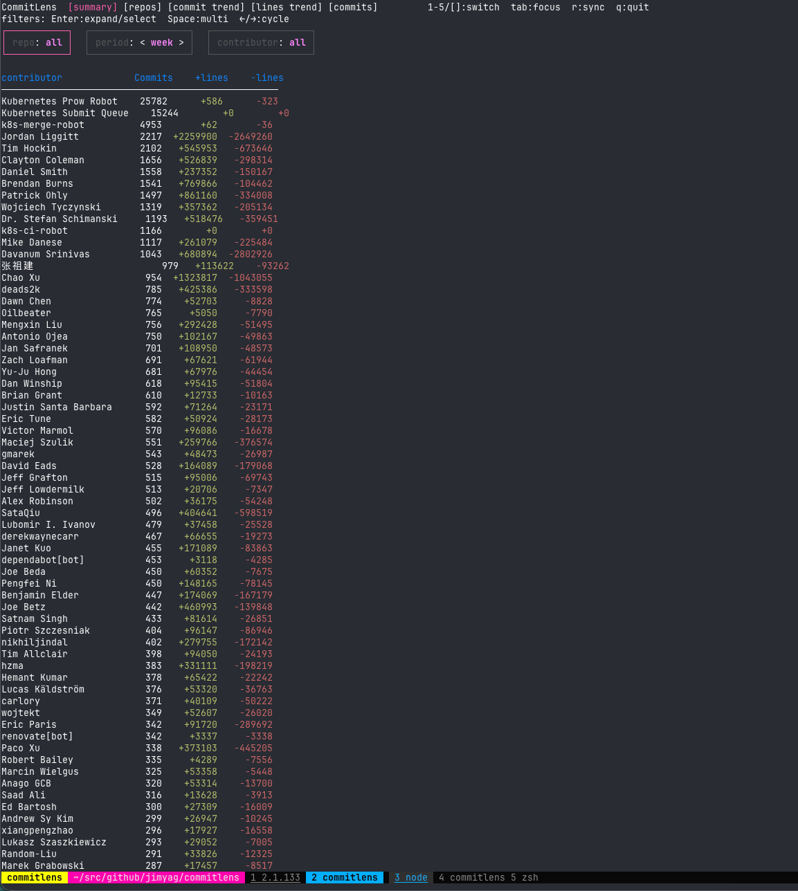
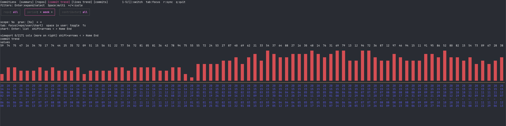
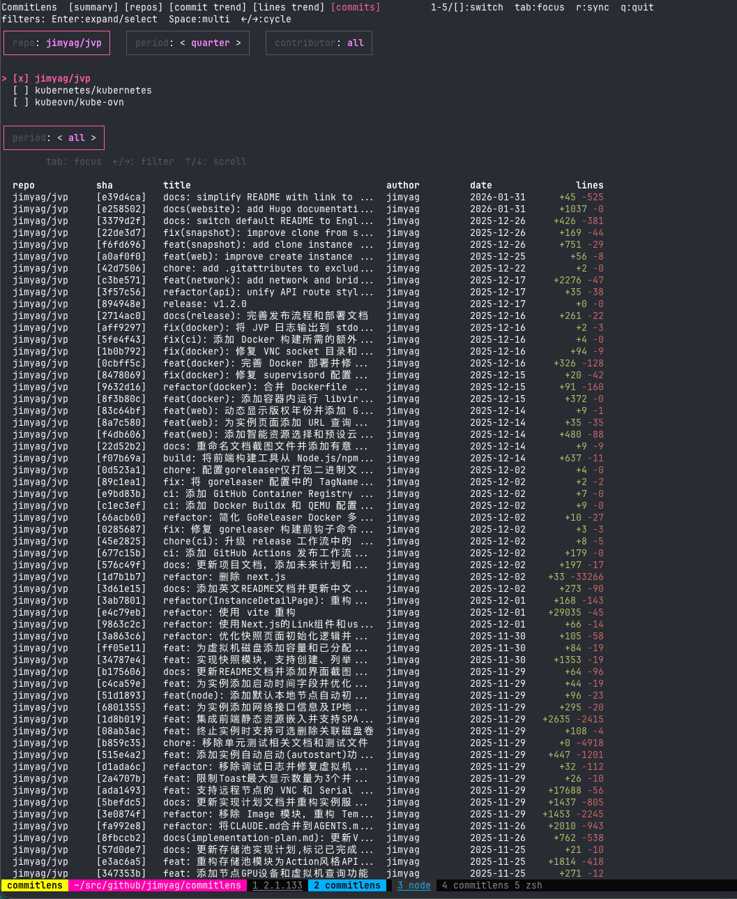
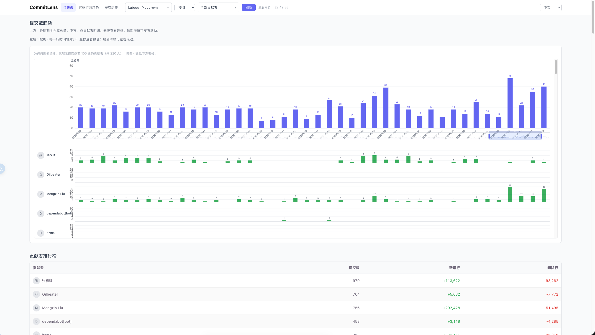
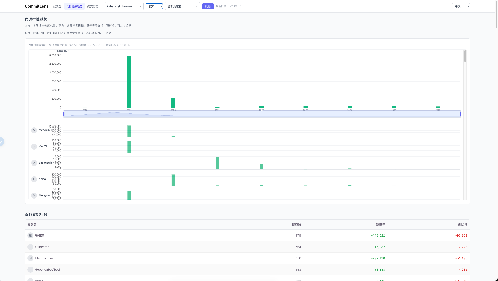
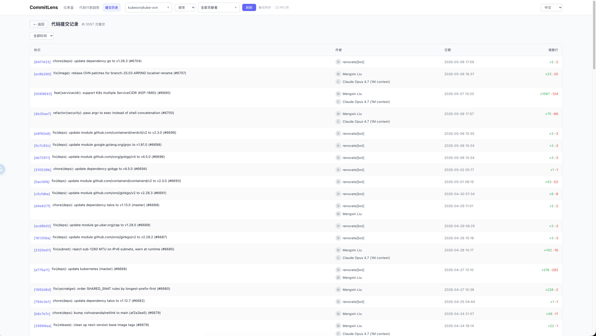

# CommitLens

A universal Git contribution analyzer that tracks **commits**, **additions**, and **deletions** per contributor. It features a powerful local Git engine, a terminal TUI, and a modern Web UI embedded in a single binary.



## Key Features

- **Universal Git Engine**: Supports both local filesystem repositories and remote GitHub URLs (via automatic bare clones). No GitHub API rate limits for history analysis.
- **Advanced Filtering**: Multi-select support for repositories and contributors. Drill down by week, month, quarter, or year.
- **Contribution Trends**:
  - **Commit Volume**: Visualize submission frequency over time.
  - **Code Lines**: Track code churn with stacked addition/deletion trends (New!).
- **Interactive TUI**: A fast, keyboard-driven terminal interface powered by `bubbletea`.
- **Modern Web UI**: A searchable, scrollable React interface with high-density ECharts visualizations.
- **Deduplicated Co-authorship**: Correctly credits all participants in a commit (via `Co-authored-by` trailers).
- **Embedded Binary**: The entire frontend is compiled into the Go binary. Just one file to run.
- **CI/CD Ready**: Integrated with GitHub Actions and GoReleaser for automated cross-platform builds.

## Screenshots

### Terminal UI (TUI)
| Commit Trend | Commit History |
| :---: | :---: |
|  |  |

### Web UI
| Dashboard (Commits) | Lines Trend | Commit History |
| :---: | :---: | :---: |
|  |  |  |

## Quick Start

### Installation
Download the latest binary from [Releases](https://github.com/jimyag/commitlens/releases).

### Configuration
Create a `config.yaml`:
```yaml
discoveryRoots:
  - ~/src/github.com/kubernetes  # Automatically scan all git repos in this folder
repositories:
  - url: https://github.com/kubeovn/kube-ovn.git # Remote repo
userMap:
  "Jim Yang": ["jimyag", "yang.jim@example.com"] # Map aliases to a single person
```

### Usage
```bash
# Run the Terminal UI
./commitlens --config config.yaml

# Run the Web UI (default: http://localhost:8080)
./commitlens --web --config config.yaml
```

## Shortcuts (TUI)
- `1-5`: Switch tabs (Summary, Repos, Commit Trend, Lines Trend, Commits).
- `[` / `]`: Cycle tabs.
- `Tab`: Cycle focus between filters and content.
- `Enter`: Expand filter dropdown / View commit details.
- `Space`: Multi-select items in dropdowns.
- `Shift + ←/→`: Scroll charts horizontally.
- `R`: Force sync/refresh data.
- `Q`: Quit.

## Development

### Requirements
- Go 1.22+
- Node.js 20+ & npm

### Build from source
```bash
make build
```

## License
MIT
