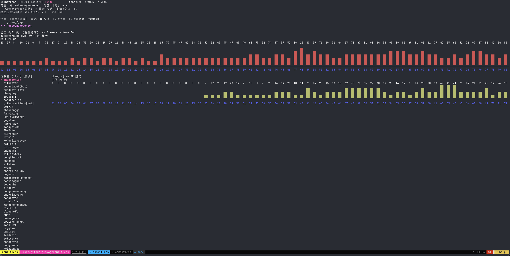
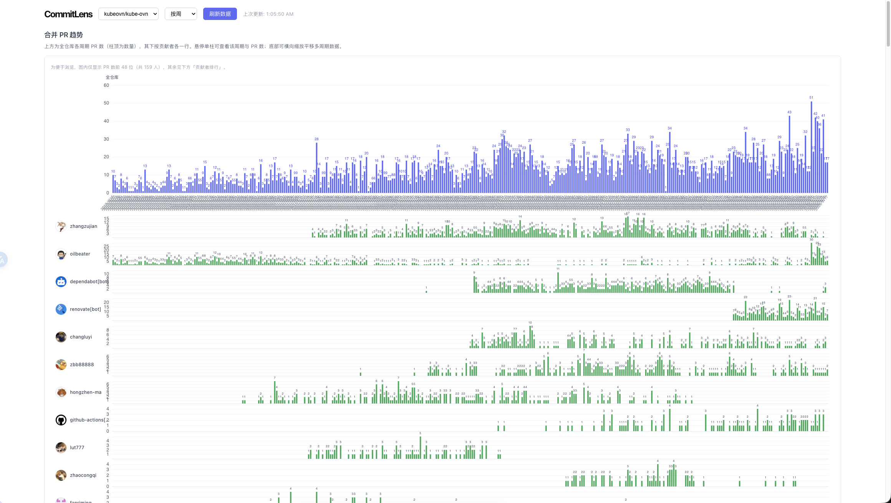
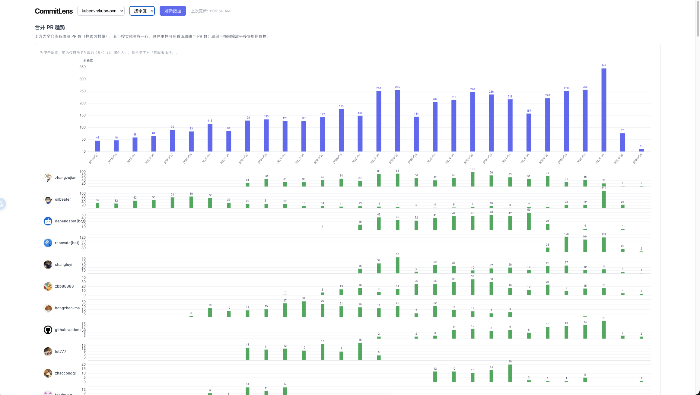

# CommitLens

统计 GitHub 仓库中各贡献者的合并 PR、提交与增删行，提供**终端 TUI**与**嵌入式 Web** 两种界面。

## 功能概览

- 从 GitHub API 拉取已合并 PR、PR 提交与 diff 统计，结果缓存在本地。
- **贡献者排行**：PR 数、Commit 数、增删行。
- **PR 趋势**：按周/月/季/年聚合；可单仓或多仓；支持合著者（见下）。
- **合著者（Co-authored-by）**：在 PR 各条 commit 的 message 中解析 `Co-authored-by: … <邮箱>`。仅当邮箱为 GitHub `users.noreply.github.com` 形式（含 `数字id+用户名@`）时解析为登录名；同一 PR 内同一用户只计一次。主作者与合著者均计入 **PR 数、Commit 数、增删行**（协作 PR 下多人头上有重复计行为预期表现）。

## 界面预览

以下示例为仓库 **`kubeovn/kube-ovn`** 的统计界面（随开发过程截取，供参考；实际以你本机数据与粒度为准）。

### 终端 TUI

单仓、**按「月」**聚合的合并 PR 趋势与选中贡献者个人柱图（左右分栏，底栏可横滚）：



### Web 界面

**按周**：上方为全仓库各周期柱顶 PR 数，下方按贡献者分行柱图，底部滑块可横向浏览更多周期。



**按季**：与按周相同布局，横轴为季度刻度。



## 构建

需安装 **Go**（版本以 `go.mod` 为准）、**Node.js**（用于打前端包）。

```bash
make build    # 先 npm build 前端，再 go build 生成 ./commitlens
```

或：

```bash
cd frontend && npm install && npm run build
go build -o commitlens .
```

## 配置

复制示例并编辑：

```bash
cp config.example.yaml ~/.commitlens/config.yaml
```

主要字段：

| 项 | 说明 |
|----|------|
| `github.token` | 可留空，默认使用 `gh auth token` |
| `repositories` | 要统计的 `owner` / `repo` 列表 |
| `cache.dir` | 原始 PR 与统计结果缓存目录 |
| `web.port` | Web 模式端口（与命令行 `--port` 二选一） |

## 使用

**终端（默认 TUI）**：

```bash
./commitlens --config /path/to/config.yaml
# 或
make run
```

**Web 界面**：

```bash
./commitlens --web --port 8080 --config /path/to/config.yaml
# 或
make run-web
```

首次运行会拉取并同步数据；在 TUI / Web 中可触发刷新。统计逻辑见 `internal/stats`（合著者解析见 `coauthor.go`）。

## 开发

```bash
make test     # go test ./...
cd frontend && npm run lint
```

## 项目结构（节选）

- `cmd/` — CLI 与同步流程
- `internal/github/` — GitHub 客户端
- `internal/stats/` — 聚合与 Co-authored-by
- `internal/tui/` — Bubble Tea 终端 UI
- `internal/web/` — 嵌入前端的 HTTP API
- `frontend/` — Vite + React 前端，经 `//go:embed` 打入二进制
